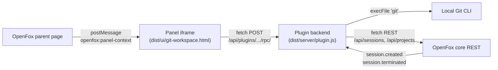

# openfox-git-workspace-map

A full OpenFox Plugin API v2 extension for understanding and operating the Git topology behind a session without forking OpenFox.

## Architecture



The plugin is split into two typed layers:

- TypeScript backend in src/plugin.ts: OpenFox contributions, RPCs, Git observation and OpenFox REST mutations.
- React + TypeScript panel in src/ui.tsx: topology, branches, workspaces, remotes, project sessions, stash, tags, log.

Vite plus vite-plugin-singlefile compiles React into one sandbox-friendly dist/ui/git-workspace.html. tsup compiles the server entry to dist/server/plugin.js.

This matches the OpenFox GitHub installer: after cloning a plugin repository, OpenFox runs npm install and npm run build when a build script exists.

## Features

- Git badge on each session row in the sidebar;
- session-local Git Workspace Map action rendered above the composer;
- topology from Git common directory (absolute path) to workspace, branch/HEAD and tracking remote;
- branch, HEAD, dirty/clean, modified files, ahead/behind;
- in-progress detection (merge, rebase, cherry-pick, revert, bisect);
- fetch/push remote URLs;
- stash list, apply, pop, drop;
- tags list, create annotated, delete;
- recent commit log with author and date;
- diff stat summary;
- merge conflict pre-flight via `git merge-tree`;
- project workspace and session inventory;
- fetch all remotes or one remote;
- checkout an existing branch;
- create and checkout a new branch through the native OpenFox session endpoint;
- create / switch workspace with optional branch/source (`mode` discriminates);
- delete workspace with conflict detection and explicit force confirmation;
- `git pull` (ff-only / rebase / merge);
- `git reset` (soft / mixed / hard) with explicit mode;
- `git_workspace_inspect` agent tool;
- `health` RPC exposing counters and cache stats;
- i18n (en / fr) and theme toggle (dark / light);
- React modals instead of `window.confirm` (sandbox-safe);
- postMessage context delivery from parent (when supported) with referrer fallback.

## OpenFox REST contract

The plugin depends on the following OpenFox REST endpoints. Every call goes through
`httpJSONWithRetry` (5xx retry with exponential backoff, 10s timeout, AbortController).

| Endpoint | Method | Body | Used by |
|---|---|---|---|
| `/api/sessions/<id>` | GET | — | `hydrateSessionContext` (workdir lookup) |
| `/api/sessions/<id>/branches` | GET | — | **Unused in current build** — `listBranches` reads local Git via `observe(c.workdir)` instead |
| `/api/sessions/<id>/checkout-new` | POST | `{ name, sourceBranch? }` | `createBranch` |
| `/api/sessions/<id>/checkout` | POST | `{ branch }` | `checkoutBranch` |
| `/api/sessions/<id>/switch-workspace` | POST | `{ target, mode: 'create'\|'switch', branch?, sourceBranch? }` | `createWorkspace`, `switchWorkspace` |
| `/api/sessions/<id>/delete-workspace` | POST | `{ target, force }` | `deleteWorkspace` (409 → retryWithForce) |
| `/api/projects/<id>/workspaces` | GET | — | `listWorkspaces` |
| `/api/projects/<id>/checkout-new` | POST | `{ name, sourceBranch? }` | `checkoutNew` |
| `/api/sessions` | GET | `?projectId=&limit=100` | `listSessions` |

> **Note:** the `mode` field on `/switch-workspace` is plugin-proposed (see upstream issue
> `US-V2.1` in the repo issue tracker). Without `mode`, OpenFox cannot distinguish
> create vs switch.

## Safety model

- Git CLI uses `execFile` (no shell injection), bounded timeouts, allowlisted refs and remotes.
- Branch/workspace mutations go through OpenFox native REST endpoints — OpenFox owns bookkeeping.
- Secrets (tokens, basic-auth URLs) are redacted before any `logger.debug` output.
- HTTP timeout (10s) and AbortController on every external call.
- Retry with exponential backoff only on 5xx, never on 4xx.
- Bundle audit in CI forbids `eval`, `new Function`, and `innerHTML=` in source.
- CSP sanity check in CI forbids `unsafe-eval` and `unsafe-inline` in the plugin bundle.

## Build

    npm install
    npm run verify

The build produces:

- dist/server/plugin.js
- dist/server/plugin.d.ts
- dist/ui/git-workspace.html with React, CSS and JS inlined

## Install in OpenFox

Settings -> Plugins -> GitHub URL:

    https://github.com/theshwal/openfox-git-workspace-map

OpenFox clones the repository, installs dependencies, runs the build, then loads dist/server/plugin.js.

## Compatibility

- OpenFox Plugin API v2
- OpenFox >= 2.0.151
- Node.js >= 20
- React 19
- TypeScript 5.8
- Vite 6

## Project configuration

Project-level preferences can be injected by OpenFox as a global variable before the panel bundle loads:

```html
<script>
  window.__GWMAP_CONFIG__ = {
    "theme": "dark",
    "lang": "en",
    "pollMs": 15000,
    "verbose": false,
    "defaultBranchFilter": "^(main|develop|feat/.*)$"
  }
</script>
```

Fields are merged with `localStorage` (localStorage wins for theme/lang/pollMs, file wins for verbose/defaultBranchFilter). The OpenFox parent can inject this via the panel host.

## Verification

`npm run verify` runs:

1. `tsc --noEmit` (strict TypeScript)
2. `vitest run` (backend + UI tests)
3. `tsup` (server build) + `vite build` (UI singlefile build)
4. Artifact smoke checks: plugin.js, plugin.d.ts, git-workspace.html exist
5. No external `src=` references in the UI bundle
6. No `eval`, `new Function`, `innerHTML=` in source
7. No `unsafe-eval` / `unsafe-inline` in plugin bundle
8. UI bundle size guard (< 600 KB)

## Migration

### 1.2.0 → 1.3.0

- `workdir` is now mandatory in every RPC. Calls without `workdir` return a structured `NO_WORKDIR` error.
- `createWorkspace` and `switchWorkspace` now send a `mode` field (`create` vs `switch`).
- `commonDir` is always returned as an absolute path.
- Added `health` RPC for diagnostics (cache size, counters, uptime).
- UI uses `postMessage` (`openfox:panel-context`) when available; referrer fallback preserved.
- `window.confirm` replaced by React modal (sandbox-safe).
- Polling has a mutex (latest refresh wins, stale responses dropped).
- Stash, tags, log, diff-stat, pull, reset, merge-conflict pre-flight, in-progress detection.
- i18n (en/fr) and theme toggle (dark/light).

### 1.1.0 → 1.2.0

Scopes the UI to the active session without any OpenFox core patch.

### 1.0.0 → 1.1.0

Migrated source development to TypeScript + React while keeping OpenFox contribution IDs and RPC names stable.

## License

MIT.
